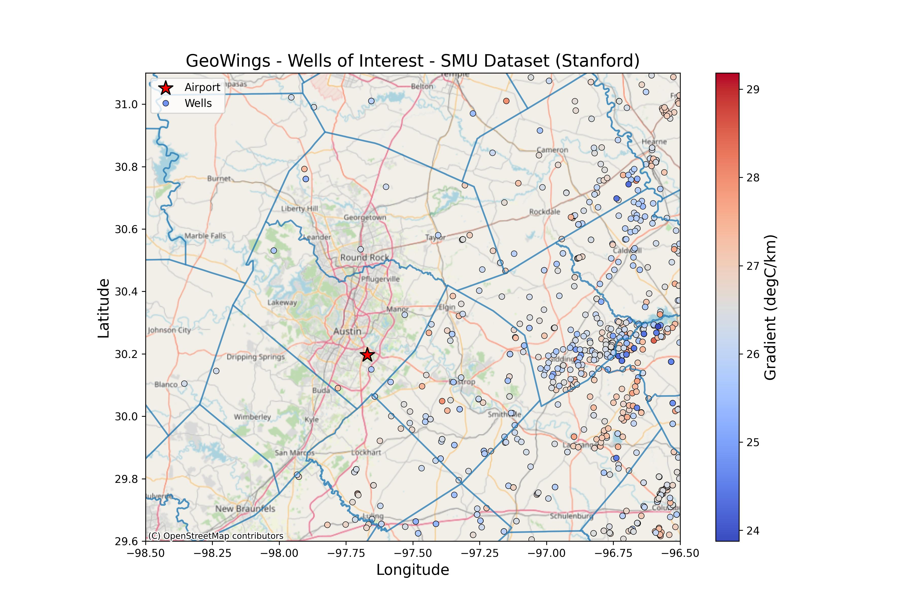

# GeoWings

Put your data under ./data folder. The data is usually too large to push to GitHub (if > 25 MB), so we should do it locally. I set the .gitignore file to discard the contents of the ./data folder.

